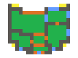

# Frontier Ship Map Render

This is a standalone utility for [Frontier Station 14][nf14]. Given a YAML file containing a ship grid, it renders a small, stylised map of the ship, like this:

These images are used in the in-game guidebook, with added annotations and coloured departments. This tool is very much an MVP and a work in progress; more features will come later. It is theoretically usable with maps from any SS14 fork, but the default configuration is adapted for use with Frontier.

You can find an online version on [shipmap.ss14.recipes](https://shipmap.ss14.recipes).

This repo is a workspace:

- [`renderer/`](./renderer) is responsible for parsing YAML and turning that into a beautiful array of raw pixel bytes. It also exposes a small CLI as an alternative to the web UI.
- [`ui/`](./ui) contains a small web frontend where you can drop your YAML file and get a live render.

## Developing

1. `npm install`
2. `npm run dev`
3. Navigate to `http://localhost:5173`, or whichever port Vite reports it's running at.

## Building & publishing

1. `npm run build`
2. Deploy the files in `ui/dist` to your server. Pure static files, easy peasy.

[nf14]: https://github.com/new-frontiers-14/frontier-station-14/
